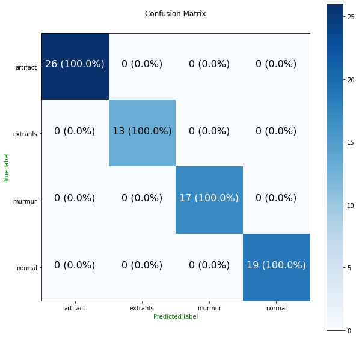

### Heart Beat Sound Classification

This is a simple audio classification model that classify the different heat beat sounds:

1. artifact
2. extrahls
3. murmur
4. normal

<p align="center">

</p>

### Data

The data for training this model was obtained from [kaggle](https://www.kaggle.com/datasets/kinguistics/heartbeat-sounds)

### Project

This model was trained for the project [HBSC](https://github.com/CrispenGari/HBSC)

### Model Metrics

The following metrics was obtained for the best model after training the model for `200` epochs:

```
+--------------------------------------------+
|    EPOCH: 198/200 saving best model...     |
+------------+-------+----------+------------+
| CATEGORY   |  LOSS | ACCURACY |        ETA |
+------------+-------+----------+------------+
| Training   | 0.084 |    0.977 | 0:00:00.61 |
| Validation | 0.046 |    1.000 |            |
+------------+-------+----------+------------+
```

### Classification Report Summary

The following table shows the summary of the classification report for the heart beat sound classification model training.

```
+------------+------------+-------+----------+------------+
| precision  | precision  |recall | f1-score |    support |
+------------+------------+-------+----------+------------+
| accuracy   |            |       | 100%     |    1495    |
+------------+------------+-------+----------+------------+
| macro avg  |    100%    |   100%| 100%     |    1495    |
+------------+------------+-------+----------+------------+
|weighted avg|    100%    |   100%| 100%     |    1495    |
+------------+------------+-------+----------+------------+
```

### Confusion Matrix

The following plot shows the confusion matrix that we obtained after training the model for `200` epochs on the test data.

<p align="center">

</p>
