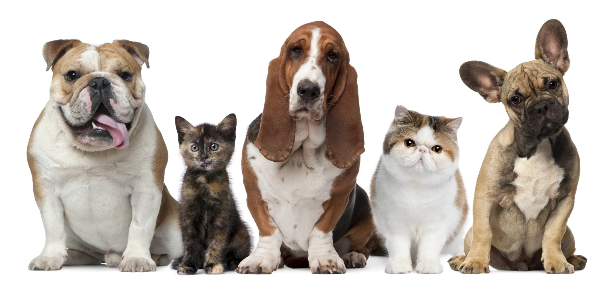
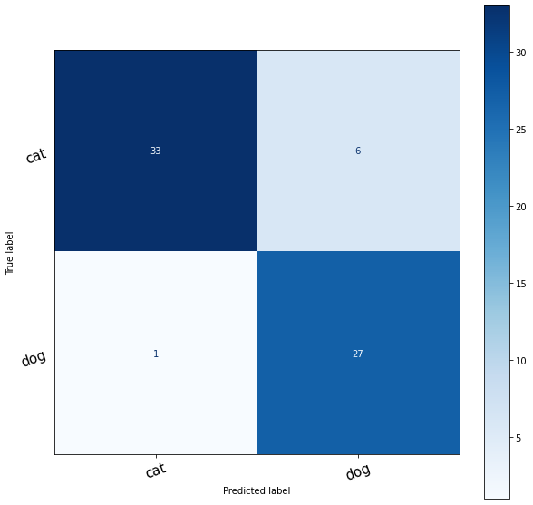

### Animal Sound Classification

This is a simple audio classification model that classify the different animal sounds between:

1. cats
2. dogs

<p align="center">

</p>

### Data

The data for training this model was obtained from [kaggle](https://www.kaggle.com/mmoreaux/audio-cats-and-dogs)

### Project

This model was trained for the project [animal-sound-classification](https://github.com/CrispenGari/animal-sound-classification)

### Model Metrics

The following metrics was obtained for the best model after training the model for `15` epochs:

```
+------------+-------+----------+------------+
| CATEGORY   |  LOSS | ACCURACY |        ETA |
+------------+-------+----------+------------+
| Training   | 0.209 |    0.935 | 0:00:02.27 |
| Validation | 0.218 |    0.907 |            |
+------------+-------+----------+------------+
```

### Classification Report Summary

The following table shows the summary of the classification report for the animal sound classification model training.

```
+------------+------------+-------+----------+------------+
| precision  | precision  |recall | f1-score |    support |
+------------+------------+-------+----------+------------+
| accuracy   |            |       |  91%     |    2305    |
+------------+------------+-------+----------+------------+
| macro avg  |     91%    |    90%|  90%     |    2305    |
+------------+------------+-------+----------+------------+
|weighted avg|     92%    |    89%|  90%     |    2305    |
+------------+------------+-------+----------+------------+
```

### Confusion Matrix

The following plot shows the confusion matrix that we obtained after training the model for `15` epochs on the test data.

<p align="center">

</p>
